# D455 稳定轮廓算法流程图与说明

更新时间：2026-06-14

## 依据

```text
D:\D455\README.md
D:\D455\D455.cpp
  - SegmentationConfig
  - DepthPostProcessor
  - makeReliableDepthAnchorMask
  - makeBoundaryAnalysis
  - extractObservationMaterials
  - refineObservationMaterialsWithPclClusters
  - calibrateMaterialsWithStableAnchors
  - selectCandidatesByCue
  - SegmentationTracker::update
  - buildDisplayStableMaterials
  - buildStableContourVisualization
  - buildIndoorPlaneAnalysis
  - AcceptanceMetricsWriter
```

## 说明

本项目当前算法目标是生成 D455 外设观察材料中的稳定轮廓。它不是端到端语义分割，也不把输出直接写成世界真值。主链路以深度和左红外灰度图为分割基础，用稳定深度锚点和历史轨迹确认轮廓稳定性；RGB 彩色流只用于原图显示和最终稳定轮廓彩图裁剪。

当前默认路径强调三件事：

1. 深度负责可测量性和三维确认。
2. 左红外灰度边缘负责不稳定边界的像素级位置。
3. 跨帧稳定点和历史轨迹负责抑制漂移、闪烁和短时误分割。

P5 分支中的 RGB 严格补边只发生在最后显示/裁剪阶段。它只在稳定轮廓小邻域内补齐断口，并要求 IoU、面积变化、中心偏移和其他轮廓隔离带都通过检查；未知背景保持黑色，不强行归入任何前景轮廓。

## 流程图

```mermaid
flowchart TD
    A["启动 D455.exe"] --> B["解析参数 SegmentationConfig / 录制 / 验收 / 测试模式"]
    B --> C["查询 RealSense 设备"]
    C --> D{"是否只探测或无设备"}
    D -- "probe-only" --> D1["返回设备探测结果"]
    D -- "无设备" --> D2["报错退出"]
    D -- "设备可用" --> E["启动 Color / Depth / Left Infrared 640x480@30"]

    E --> F{"是否进入专项测试模式"}
    F -- "depth-stability" --> F1["深度稳定性采样评估"]
    F -- "anchor-only" --> F2["可靠深度锚点采样评估"]
    F -- "stable-contour-test/video" --> F3["稳定轮廓测试或视频模式"]
    F -- "rgb-depth-accuracy" --> F4["RGB 单目深度对照测试"]
    F -- "主窗口模式" --> G["初始化 align-to-color / DepthPostProcessor / Tracker / Recorder / CSV"]

    G --> H["等待 frameset 并对齐到 Color"]
    H --> I["读取 Color / Depth / Left Infrared"]
    I --> J["深度后处理: Depth to Disparity / Spatial / Temporal / Disparity to Depth / Hole Filling"]
    J --> K["转换 Mat: colorBgr / rawDepth16 / filteredDepth16 / segmentationGray"]
    K --> L["选择边缘灰度源: 优先左红外; 缺失时退回彩色灰度"]

    L --> M["生成可靠稳定锚点 anchorMask"]
    M --> M1["原始深度与滤波深度一致性"]
    M --> M2["局部邻域深度范围稳定"]
    M --> M3["排除边缘膨胀区"]
    M1 --> N["稳定锚点结果"]
    M2 --> N
    M3 --> N

    N --> O["边界分析 makeBoundaryAnalysis"]
    O --> O1["有效深度 mask 与深度突变边"]
    O --> O2["深度空洞边诊断"]
    O --> O3["红外灰度 Canny 边"]
    O --> O4["深度支持灰度边"]
    O --> O5["局部深度跨度确认的灰度轮廓边"]
    O1 --> P["生成 splitBoundaryMask"]
    O2 --> P
    O3 --> P
    O4 --> P
    O5 --> P

    P --> Q["候选材料提取 extractObservationMaterials"]
    Q --> Q1["按深度切片构造 mask"]
    Q1 --> Q2["扣除 splitBoundaryMask"]
    Q2 --> Q3["形态学清理与连通域"]
    Q3 --> Q4["面积 / ROI / 边界大块过滤"]
    Q4 --> Q5["ROI 内局部 mask 统计深度和点云边界"]
    Q5 --> Q6["findContours 提取精细轮廓"]
    Q6 --> Q7["按面积排序并限制 maxMaterials"]

    Q7 --> R{"PCL 聚类是否启用"}
    R -- "启用" --> R1["候选内有效深度点反投影为点云"]
    R1 --> R2["PCL EuclideanClusterExtraction"]
    R2 --> R3["按 frameInterval 缓存 cluster 结果"]
    R3 --> S["带 3D cluster 的候选材料"]
    R -- "关闭" --> S0["保留 OpenCV 候选材料"]
    S0 --> S

    S --> T["稳定锚点校准候选"]
    T --> T1["统计轮廓内 anchor 数量"]
    T1 --> T2{"anchor 数是否达到 stable-contour-min-anchors"}
    T2 -- "不足" --> T3["丢弃或不进入稳定候选"]
    T2 -- "足够" --> T4["用 anchor 校准中心和深度"]

    T4 --> U["Cue Selection 择机"]
    U --> U1["深度边可信"]
    U --> U2["深度确认的灰度边可信"]
    U --> U3["强稳定锚点可信"]
    U --> U4["纹理单独主导且深度/锚点弱则拒绝"]
    U1 --> V["进入历史 Tracker"]
    U2 --> V
    U3 --> V
    U4 --> V

    V --> W["SegmentationTracker::update"]
    W --> W1["按 ROI 重叠 / 中心距离 / 深度差 / 面积比例匹配"]
    W1 --> W2["连续 confirm 帧后显示为稳定材料"]
    W2 --> W3["短时 miss 由历史保持"]
    W3 --> W4["平滑中心 / ROI / 深度 / 面积"]
    W4 --> X["stableMaterials"]

    X --> Y["稳定支持统计与 track aggregate"]
    X --> Z{"是否启用室内平面诊断"}
    Z -- "启用" --> Z1["降采样法线与大平面 mask"]
    Z1 --> Z2["扣除稳定前景"]
    Z2 --> Z3["输出 wall / ceiling / support 诊断"]
    Z -- "关闭" --> AA["跳过平面诊断"]

    Y --> AB{"是否需要显示或录制"}
    Z3 --> AB
    AA --> AB
    AB -- "否" --> AC["只写验收 CSV 或继续下一帧"]
    AB -- "是" --> AD["构建第二窗口稳定轮廓信息图"]
    AD --> AE["buildDisplayStableMaterials"]
    AE --> AE1{"RGB 严格补边是否启用"}
    AE1 -- "启用" --> AE2["仅在稳定轮廓邻域内找彩图补齐候选"]
    AE2 --> AE3["检查 IoU / 面积变化 / 中心偏移 / 其他轮廓隔离"]
    AE3 --> AE4{"补齐是否可信"}
    AE4 -- "可信" --> AE5["采用彩图补齐轮廓用于显示裁剪"]
    AE4 -- "不可信" --> AE6["保留原稳定轮廓"]
    AE1 -- "关闭" --> AE6
    AE5 --> AF["第三窗口: 稳定轮廓内彩图"]
    AE6 --> AF
    AF --> AG["第四窗口: 黑区对应原始彩图"]
    AG --> AH["可选第五窗口边界诊断 / 第六窗口平面诊断"]
    AH --> AI["imshow / VideoRecorder / AcceptanceMetricsWriter"]
    AC --> AJ["frameId++ / 检查 maxFrames 或 q/Esc"]
    AI --> AJ
    AJ --> H

    X -. "只表示外设观察材料或稳定候选轮廓" .-> BND1["边界: 不直接等于世界真值"]
    AE -. "RGB 只做最后裁剪补边" .-> BND2["边界: 不参与主分割决策"]
    Z3 -. "平面目前是诊断路径" .-> BND3["边界: 默认不覆盖前景稳定轮廓"]
```



## 阶段说明

### 1. 采集与对齐

程序启动后打开 RealSense D455 的 Color、Depth、Left Infrared 三路流，分辨率和帧率默认为 640x480@30。主模式下使用 `rs2::align` 将深度帧对齐到彩色帧坐标系，保证后续轮廓、锚点和彩图裁剪都在同一像素坐标下工作。

### 2. 深度后处理

深度链路通过 `DepthPostProcessor` 执行 RealSense 常见滤波顺序：Depth to Disparity、Spatial、Temporal、Disparity to Depth、Hole Filling。代码同时保留原始深度和滤波深度：原始深度用于判断锚点可信度，滤波深度用于候选分割、深度统计和显示。

### 3. 灰度边缘来源

默认优先使用左红外灰度图作为边缘来源。左红外图和深度来自同一 D455 设备，在弱彩色纹理或彩色曝光变化场景下比 RGB 彩色边更适合做几何边界。只有红外帧缺失时才退回彩色灰度。

### 4. 稳定锚点

可靠锚点来自稀疏采样。一个像素要成为稳定锚点，需要满足原始深度和滤波深度差距较小、邻域深度变化范围较小，并且不落在膨胀后的边缘附近。锚点不是最终轮廓，而是用来判断候选轮廓是否有稳定深度支撑。

### 5. 边界分析

`makeBoundaryAnalysis` 同时生成深度突变边、深度空洞边、红外灰度边、深度支持灰度边和深度确认灰度轮廓边。最终 `splitBoundaryMask` 用来把深度切片中的大连通域切开，解决椅背、人体、墙面、窗帘等在深度上局部粘连的问题。

### 6. 候选材料提取

`extractObservationMaterials` 按深度切片生成候选 mask，扣除切分边界，执行形态学清理和连通域分析，再经过面积、ROI、边界大块过滤。当前优化版在每个组件 ROI 内局部计算 mask、深度统计、点云边界和精细轮廓，避免为每个组件重复扫描整帧。

### 7. PCL 3D 聚类辅助

当 `pclClustering` 启用时，候选材料内部的有效深度点会反投影到三维点云，并通过 PCL 欧式聚类给候选标记 3D cluster。这个步骤的主要作用是阻止二维近邻误合并，不替代 OpenCV 轮廓显示；显示仍使用完整轮廓，避免稀疏点云导致条纹漏空。

### 8. 稳定锚点校准与 cue selection

候选轮廓必须有足够数量的稳定锚点支撑，默认 `stable-contour-min-anchors=16`。通过后，候选中心和深度会按稳定锚点校准。`selectCandidatesByCue` 再按深度边、深度确认灰度边、强锚点等证据择机保留候选；只有明显由灰度纹理单独主导且深度和锚点都弱的候选会被拒绝。

### 9. 历史稳定跟踪

`SegmentationTracker` 负责跨帧匹配和稳定确认。匹配依据包括 ROI 重叠、中心距离、平均深度差和面积比例。新候选需要连续命中若干帧才显示为稳定材料；已有稳定材料允许短时丢失，避免瞬时黑洞或边缘抖动导致轮廓闪烁。

### 10. RGB 严格补边和四窗口输出

RGB 彩色流不参与主分割。只有在需要显示或录制时，`buildDisplayStableMaterials` 才会在稳定轮廓小邻域内尝试彩图补边。补边必须满足 IoU、面积变化、中心偏移和其他轮廓隔离带限制，否则继续使用原稳定轮廓。第三窗口只显示稳定轮廓内彩图，第四窗口显示第三窗口黑区对应的原始彩图。

### 11. 诊断与验收指标

验收模式通过 `AcceptanceMetricsWriter` 输出逐帧 CSV，包括总耗时、候选数、稳定轮廓数、稳定区/黑区比例、跨帧轮廓 IoU、边界抖动近似值、边界来源像素数、cue 选择统计、平面诊断统计和各阶段耗时。

最近一次本地 CPU 纯算法验收结果显示，ROI 局部扫描优化后，600 帧平均耗时约 29.810ms 到 34.479ms，对应约 29.00 FPS 到 33.55 FPS；开启彩图补边和录制后，耗时主要转移到 completion 和 record 路径。

## 关键边界

```text
1. 稳定轮廓输出是外设观察材料或稳定候选轮廓，不是世界真值。
2. RGB 彩色图只在最后显示/裁剪阶段使用，不作为当前主分割依据。
3. 未知背景保持黑色，不强行分配给任何前景轮廓。
4. PCL 只做三维聚类辅助确认，不替代完整二维轮廓显示。
5. 室内平面分析当前默认是诊断路径，不覆盖第三/第四窗口的稳定轮廓结果。
6. 当前稳定性指标是跨帧轮廓稳定性，不等价于公开数据集的语义分割 mIoU。
```

## 后续改进方向

```text
1. 建立固定验收视频集和人工轮廓标注，补充 mask IoU、boundary F1、temporal IoU、jitter、FPS。
2. 将平面/法线背景结构从诊断路径升级为保守约束，用于天面、墙面、地面，不抢前景稳定轮廓。
3. 对 RGB 严格补边做降频、缓存和 ROI 级优化，降低 completion_ms。
4. 将深度空洞区域单独建模为 unknown / occlusion / invalid depth，不把黑洞直接归入前景。
5. 后续可把 SAM2、RGB-D 语义分割、VOS 作为增强模块或离线对照基线，而不是第一阶段主链路。
```
