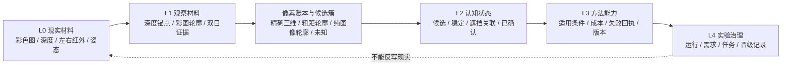
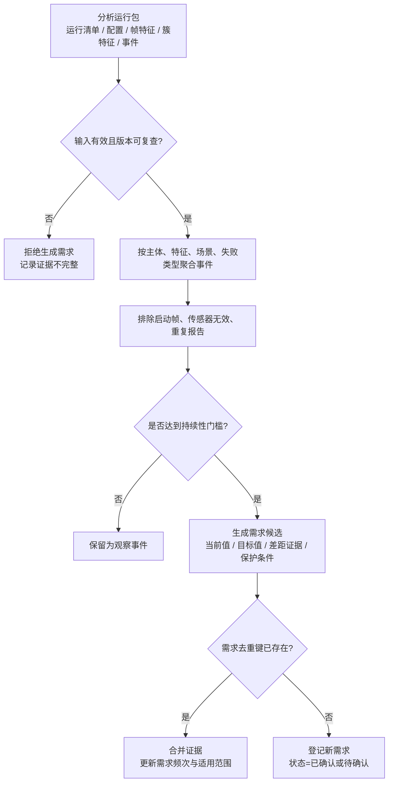
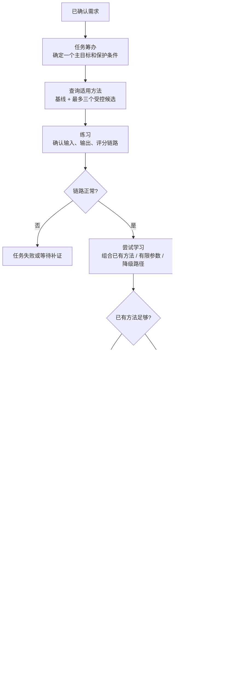
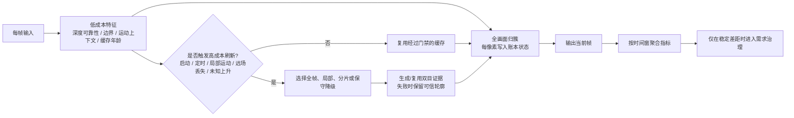
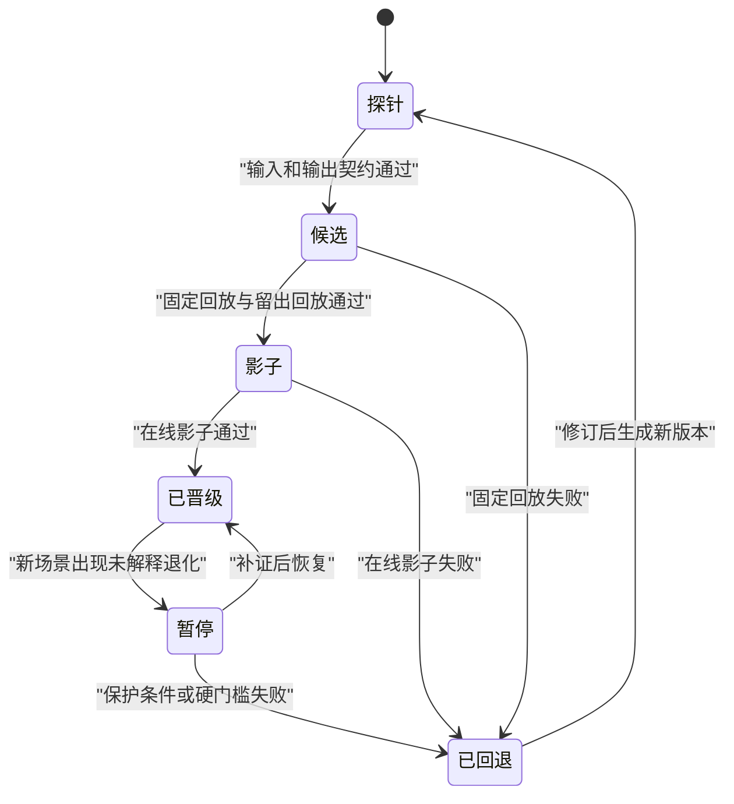
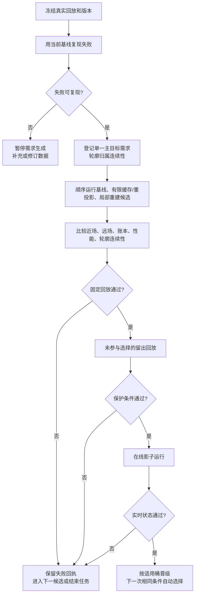

# D455 视觉方法需求—任务—学习—晋级闭环流程图

本文与《视觉方法需求—任务—学习—晋级闭环详细设计》配套。图中“当前已具备”表示仓库已有运行链路；“设计待实现”表示需要后续确认和计划，不代表当前代码已经完成。

## 一、三层事实边界



约束：观察材料和认知候选不能直接等同于现实存在；实验报告和历史回放也不能改写当前场景事实。

## 二、需求生成与去重



需求去重键：

```text
目标主体 + 目标特征 + 失败类型 + 场景桶 + 触发方法版本
```

## 三、任务筹办与学习状态



## 四、单帧实时感知与低频治理分离



实时感知环不应把每帧、每个像素直接创建为任务；需求治理环只处理经过时间窗聚合的稳定差距。

## 五、方法生命周期



晋级始终带适用桶；例如“慢速相机平移已晋级”不等于“局部运动已晋级”。

## 六、首轮手部遮挡—重现验证链



## 七、与当前仓库的对应关系

```text
当前已经具备：
  D455 采集/目录回放
  analysis_runs 标准分析包
  frame_metrics.csv / cluster_metrics.jsonl / events.csv
  score_run.py / select_winners.py
  candidate 按场景桶比较的基础

设计待实现：
  失败事件到需求候选的自动聚合和去重
  需求、任务、正式方法、晋级记录的持久化结构
  任务状态机和适用方法查询
  留出回放与在线影子门禁
  按适用桶自动晋级、回退和下一次选择
  向上层存在体素/世界树服务传递候选证据的接口
```
