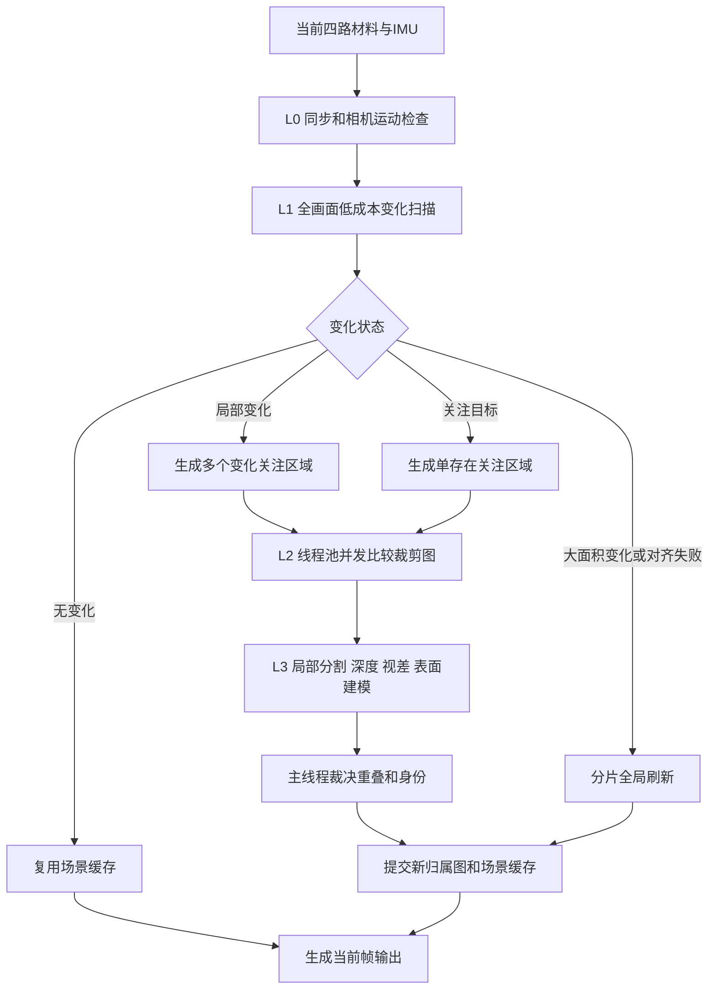

# 视觉注意力、场景缓存、差异扫描与并发关注区域处理方案 v0.1

## 一、文档目标

本方案用于把当前“全画面每帧完整重算”调整为：

> 全画面负责快速发现变化，关注区域负责确认和解释变化，存在内部负责精确建模；未变化区域复用已验证缓存，多个独立关注区域并发处理。

目标是同时降低：

- 每帧处理面积；
- 重复分割和重复测深；
- 全图双目匹配次数；
- 全图点云和轮廓计算；
- 相机静止时的无效重复工作；
- 完整刷新造成的画面顿挫。

本方案只优化观察计算调度，不改变以下真实性边界：

```text
本帧未处理 ≠ 背景
缓存复用 ≠ 当前帧直接测量
彩图未变化 ≠ 精确深度一定未变化
历史精确深度 ≠ 当前帧新增精确深度事实
```

## 二、核心原则

### 2.1 扫描必须是最快环节

扫描只回答：

```text
哪里发生了变化？
变化面积有多大？
是否需要进入高成本处理？
```

扫描不负责：

- 完整分割；
- 存在识别；
- 双目精确匹配；
- 点云聚类；
- 最终归属裁决。

扫描允许少量误报，但必须尽量避免漏报。误报只会多处理一个小区域；漏报会让新存在、遮挡或目标移动完全未被发现。

### 2.2 全画面账本始终保留

即使只关注中心或一个存在，全画面仍维护像素账本：

```text
当前帧直接确认
缓存复用确认
历史预测待确认
变化待重算
本帧未关注
未知
```

周边区域可以降低处理频率和分辨率，但不能被自动写成背景。

### 2.3 未变化区域不重复执行完整视觉链路

已建立场景缓存后，未变化区域只执行：

```text
缓存对齐
低成本差异扫描
少量深度锚点复核
缓存年龄与置信度更新
```

完整颜色分割、双目匹配、点云聚类和局部表面拟合只处理变化区域。

### 2.4 并发任务只读输入，统一提交结果

多个关注区域可以并发比较，但工作线程不能直接修改全局归属图或场景缓存。所有结果由主线程按确定顺序裁决并提交。

## 三、总体处理层级



处理层级定义：

| 层级 | 责任 | 频率 |
|---|---|---|
| L0 | 同步、IMU、姿态和输入有效性 | 每帧 |
| L1 | 低分辨率全画面变化扫描 | 每帧 |
| L2 | 关注区域缓存比较 | 仅变化区域 |
| L3 | 局部分割、深度、视差、点云和表面 | 仅确认需要重算的区域 |
| L4 | 完整场景重建 | 低频、分片或异常触发 |

## 四、场景缓存数据结构

### 4.1 全画面场景缓存

建议包含：

```text
缓存参考彩图
缓存灰度图
缓存梯度图
全画面像素归属图
全画面存在标识图
缓存深度锚点图
缓存相机姿态
缓存建立帧号
缓存版本
缓存有效区域
```

### 4.2 存在缓存项

每个已登记存在保存：

```text
存在标识
存在轮廓掩码
轮廓外接矩形
局部彩图模板
局部梯度模板
可靠深度锚点
距离模式
距离区间
局部表面列表
最后确认帧号
缓存年龄
缓存置信度
是否接触关注区域边缘
```

### 4.3 关注状态

```text
关注存在标识
关注区域
关注区域安全边距
关注置信度
关注持续帧数
目标预测位置
目标丢失帧数
周边刷新间隔
```

## 五、全画面快速变化扫描

### 5.1 输入准备

建议将640×480当前彩图缩小到：

```text
320×240：较精细扫描
160×120：最快周边扫描
```

缓存参考图使用相同分辨率。每帧只准备一次缩小灰度图和梯度图，所有关注区域共享，避免重复转换。

### 5.2 扫描流程

```text
判断相机运动
→ 对齐当前缩略图与缓存缩略图
→ 计算归一化灰度差
→ 计算梯度/边缘差
→ 按16×16或32×32块汇总
→ 生成脏区掩码
→ 合并相邻脏块
→ 映射回原分辨率并扩展安全边距
```

建议方法名称：

```text
判断相机运动
对齐场景缓存
扫描全画面变化
生成脏区掩码
合并相邻变化块
扩展关注区域边距
```

### 5.3 变化状态分类

| 状态 | 判定 | 动作 |
|---|---|---|
| 无变化 | 对齐可靠，脏区很小 | 复用缓存 |
| 局部变化 | 少量连续脏块 | 创建局部关注区域 |
| 全局亮度变化 | 灰度整体变化、梯度结构稳定 | 重新归一化，不立即重分割 |
| 相机移动 | IMU或视觉位移超过门槛 | 先重投影缓存 |
| 对齐失败 | 投影误差过大 | 触发分片全局刷新 |
| 大面积结构变化 | 脏区面积超过门槛 | 扩大关注范围或全局刷新 |

### 5.4 低成本深度复核

彩图相似不能单独证明三维状态未变。每个存在内部保留少量可靠深度锚点：

```text
彩图和梯度未变化
且深度锚点一致
→ 高可信复用

彩图未变化
但深度锚点冲突
→ 创建局部深度复查任务
```

深度锚点只采样稳定内部区域，不采样深度边缘、孔洞或65535饱和值。

## 六、中心关注与单存在关注

### 6.1 固定中心关注

第一阶段可使用固定中心区域验证性能：

```text
原图：640×480
中心关注区域：320×240
处理面积：全图25%
```

中心区域执行完整视觉链路，周边只做低分辨率变化扫描。

### 6.2 单存在关注

选择一个存在后：

```text
预测存在位置
→ 生成存在外接矩形
→ 增加安全边距
→ 完整处理轮廓内部
→ 更新存在轮廓和局部表面
→ 检查是否接触区域边缘
```

出现以下事件时扩大区域或退回全局搜索：

- 存在轮廓接触区域边缘；
- 存在面积或中心突变；
- 身份置信度下降；
- 相机发生移动；
- 关注区域未知比例上升；
- 周边扫描发现新运动。

## 七、双目关注区域边界

左右双目不能裁剪相同横坐标范围。左图目标在右图中会因视差横向移动。

```text
右图搜索区域
= 左图关注区域
+ 最大可能视差宽度
+ 标定误差边距
+ 跟踪预测边距
```

距离越近，最大视差越大，右图搜索区域越宽。若未增加视差边距，近处目标可能被右图裁剪掉，造成虚假双目失败。

建议方法名称：

```text
计算双目搜索边距
生成左图关注区域
生成右图搜索区域
校验双目重叠范围
```

## 八、多个裁剪图并发比较

### 8.1 线程结构

```text
主线程：取帧、全局对齐、变化扫描、任务生成、结果裁决、缓存提交
工作线程：只读当前帧和旧缓存，处理独立关注区域
```

工作线程可并发执行：

- 当前裁剪图与缓存模板比较；
- 轮廓重叠率；
- 颜色和梯度差异；
- 深度锚点复核；
- 局部深度稳定；
- 局部双目视差；
- 局部表面和点云处理。

### 8.2 固定线程池

禁止为每个轮廓创建新线程。建议初始线程数：

```text
工作线程数 = min(逻辑核心数 - 1, 4)
```

小区域应合并批处理，避免任务调度开销大于计算本身。

### 8.3 任务字段

每个关注区域任务携带：

```text
任务标识
任务优先级
来源帧号
相机姿态版本
缓存版本
存在标识
关注区域
只读当前材料句柄
只读缓存句柄
截止时间
```

每个结果携带：

```text
任务标识
来源帧号
缓存版本
变化比例
新轮廓
深度与视差结果
置信度
处理耗时
是否过期
```

### 8.4 确定性合并

工作线程不写全局像素归属图。主线程按以下优先级裁决重叠：

```text
当前关注存在
> 当前帧可靠深度支持
> 已稳定存在
> 新轮廓候选
> 周边缓存
```

重叠区域分为：

```text
核心写入区域：只能由一个结果提交
扩展读取边距：允许多个任务读取
冲突区域：由主线程统一裁决
```

### 8.5 避免嵌套并行

需要对比：

```text
方案甲：关注区域串行，OpenCV内部并行
方案乙：关注区域线程池并行，OpenCV内部单线程
```

禁止形成“多个工作线程 × 每个OpenCV函数再次开多线程”的过度订阅。

## 九、任务优先级和异步流水线

任务优先级：

```text
高：当前关注存在
中：明显变化区域
低：周边缓存确认
后台：完整场景分片刷新
```

不等待所有周边任务完成才显示当前帧。关注存在完成后即可生成当前输出，周边结果可以在后续帧提交。

异步流水线：

```text
主线程采集第N+1帧
工作线程处理第N帧关注区域
主线程应用仍与当前姿态和缓存版本一致的结果
```

来源帧号、姿态版本或缓存版本不一致时，旧结果必须丢弃。

## 十、缓存状态与真实性语义

每个像素的深度和归属必须保留来源：

```text
当前帧直接测量
当前帧外观复核后缓存复用
多帧稳定测量
历史重投影
历史值短时保持
局部表面推算
只有存在级距离区间
本帧未关注
未知
```

缓存复用可以维持分割和身份连续性，但不能把历史深度写成当前帧直接测量。

## 十一、性能模型

设：

```text
固定扫描耗时 = 扫描和对齐成本
完整处理耗时 = 全画面完整视觉链路成本
脏区比例 = 本帧需要完整重算的面积比例
调度合并耗时 = 线程池和结果裁决成本
```

则：

```text
单帧耗时
≈ 固定扫描耗时
+ 脏区比例 × 完整处理耗时
+ 调度合并耗时
```

示例：固定扫描4ms、完整处理60ms：

| 脏区比例 | 估算单帧耗时 |
|---:|---:|
| 0% | 约4ms |
| 10% | 约10ms |
| 25% | 约19ms |
| 50% | 约34ms |
| 100% | 约64ms |

多个独立区域并发时，总耗时接近：

```text
所有任务总工作量 / 有效工作线程数
+ 最慢单任务约束
+ 调度和合并开销
```

一个巨大区域仍由最慢任务决定，需要继续分片。

## 十二、建议性能预算

| 阶段 | 目标耗时 |
|---|---:|
| 缩小、灰度和梯度准备 | 1–2ms |
| 相机姿态和缓存对齐 | 1–3ms |
| 全画面低分辨率扫描 | 1–2ms |
| 脏块合并和任务生成 | <1ms |
| 多关注区域并发处理 | 10–20ms |
| 结果裁决和缓存提交 | 2–4ms |
| 普通局部变化帧总计 | 15–30ms |

阶段目标：

```text
静态无变化帧：<10ms
普通局部变化帧：<25ms
总帧耗时p95：<33ms
完整刷新：必须分片或异步，不形成单帧长停顿
```

## 十三、必须记录的特征值

扫描特征：

```text
对齐置信度
全局亮度变化量
变化像素比例
脏块数量
脏区面积比例
相机运动量
周边运动块数量
```

缓存特征：

```text
缓存复用像素比例
缓存平均年龄
缓存最大年龄
缓存失效存在数量
当前帧直接测量像素比例
历史复用像素比例
```

并发特征：

```text
关注区域任务数量
任务排队耗时
各工作线程耗时
最长关注区域耗时
主线程等待耗时
结果应用耗时
过期结果丢弃数量
工作线程利用率
```

质量特征：

```text
变化漏检事件
错误全局刷新事件
存在重新捕获时间
关注区域裁断事件
缓存错位事件
轮廓丢失事件
错误合并和分裂事件
```

## 十四、失败与回退条件

以下任一条件触发扩大关注区域或全局重建：

- 对齐置信度低于门槛；
- 相机运动超过缓存重投影能力；
- 脏区面积超过全画面40%–50%；
- 当前关注存在接触区域边缘；
- 缓存深度锚点与当前测量冲突；
- 周边发现新大目标；
- 缓存年龄超过上限；
- 多个关注区域结果冲突无法裁决；
- 变化扫描持续高误报或发生漏报。

全局重建应分片或后台执行，避免在单帧中集中产生长耗时。

## 十五、分阶段实现顺序

### 第一阶段：固定中心关注

```text
固定中心320×240
周边160×120变化扫描
只统计速度和裁剪正确性
```

### 第二阶段：场景缓存和差异扫描

```text
建立缓存参考图和像素归属图
实现对齐、分块差异和脏区生成
未变化区域复用
```

### 第三阶段：多个关注区域并发

```text
固定线程池
只读任务输入
独立结果
主线程确定性合并
```

### 第四阶段：单存在关注

```text
关注存在选择
区域预测
边缘接触检测
目标丢失和重新捕获
```

### 第五阶段：姿态和三维重投影

```text
IMU姿态预测
历史三维点重投影
多深度层缓存对齐
运动场景回退门禁
```

## 十六、验收方案

固定回放至少包含：

```text
完全静止场景
局部小目标运动
手部遮挡后重现
相机慢速平移
全局亮度变化
多个区域同时变化
关注目标离开并重新进入
```

验收门槛建议：

```text
无变化帧p95 < 10ms
局部变化帧p95 < 33ms
变化漏检事件 = 0
缓存错位事件 = 0
关注目标轮廓丢失不增加
近场精确深度不退化
周边新目标可在限定帧数内被发现
过期异步结果不得写入新帧
```

## 十七、最终结论

该方案通过三种手段组合提升效率：

```text
减少处理面积
跳过未变化区域
并发处理独立关注区域
```

最重要的处理顺序是：

> 扫描负责最快发现差异，缓存比较负责确认差异，局部视觉负责解释差异，主线程负责统一裁决事实。

在静态或缓慢变化场景中，绝大多数帧应在扫描和缓存复用阶段结束，不再进入完整全画面视觉链路。
